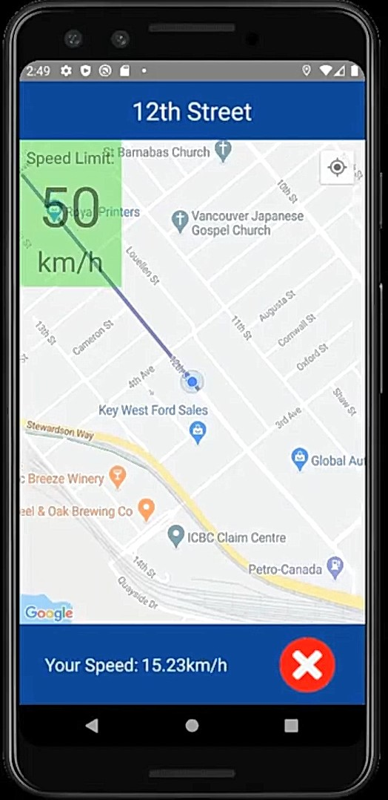

## What is Safe Traveller?
Safe Traveller is an android app that helps people to maintain the speed limit rules by displaying the speed limit of any street that the user is currently on. If the user crosses the speed limit, the app notifies the user and signifies the warning.

## App in use
__Opening Screen__: Like any other navigation app, you are asked to enter your destination. Note that the map data is obtained from Google Maps API and the routing data is obtained from Google Directions API.
 

__Navigating__: The important aspects to note here is that the app mentions the current speed limit(top left) as well as the current user speed (bottom center). Note that since the current speed is well under the limit the speed limit is highlighted in green so that the driver can casually check the screen and be aware, rather than trying to look closely.
 

__Going over speed limit__: As seen in the snapshot below, there is a visual indicator (highlight around speed limit turns bright red) as the user crosses the speed limit. Furthermore, the user will also get a verbal indicator.
 

## APIs and dataset used
* Google Maps API: Required to load the map graphics.
* Google Geolocation API: Required to get the accurate user location and convert coordinates into textual addresses and vice versa.
* Google Directions API: Required to get the directions from user's location to the destintion. Returns a JSON with the coordinates of all the turns to be made in order to reach the destination. This JSON is then translated by the app graphically and navigation lines are drawn on the app.
* City of New Westminster Open Dataset (http://opendata.newwestcity.ca/datasets/speed-signs): Dataset that contains the coordinates of all the speed posts in the city of New Westminster. This data is translated by the app to figure out real time user speed limit.

## Limitations
Currently it is only supported in the city of New Westminster as it is the only place in Metro Vancouver that has made its dataset publicly available.

## Future Plans
* Since the UI is not completely necessay, we plan to make Safe Traveller as a service that runs in the background whenever you want it to. The service will only notify you vocally if you cross the speed limit. Since it wont have any UI, it will also consume less battery.
* Try to obtain datasets for other cities of Metro Vancouver and beyond to reach a wider audience.
